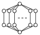
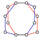

# Ring Statistics Algorithm

## Counting policy

* It counts only irreducible rings (rings not having shortcut bridges).
* It counts rings purely topologically. It does not use geometrical information.
* Edge direction is not considered. (Undirected graph)

## Algorithm

1. Choose 3 successive nodes (i.e. two adjacent acyclic edges) along the network. (King's criteria) [King1991]
1. Find the smallest rings passing the three nodes.
1. The ring must not have shotcuts, i.e. path connecting two vertices on the ring which is shorter than the path along the ring. (Using Dijkstra's algorithm.) (Franzblau's SP ring criteria) [Franzblau1991]
1. Put the ring in the list.
1. Repeat 1 .. 4 until all sets of 3 successive nodes are tested.
1. Eliminate the permutations of a ring in the list.
1. (Optional) Remove "crossing rings".

So, our definition is a hybrid of the algorithms of King and Franzblau.

### Note

* Our definition is different from Franzblau's SP ring. Our algorithm does not count the 6-membered rings in a cubic graph but counts the geodesic 4-membered rings in a regular octahedral graph. [Franzblau1991]
* Our definition is different from King's K ring. [King1991]
* Our definition is different from Goetzke's strong ring. We do not care the strength. [Goetzke1991]
* Our definition is different from that of Camisasca's. They count too much 5-membered rings. [Camisasca2019]
* Probably somebody has already made the same definition. Let me know if you find that.

## Usage

    usage: countrings [-h] [--count] [--debug] [--quiet] [maxsize]
    
    positional arguments:
      maxsize      Maximum size of the ringd
    
    optional arguments:
      -h, --help   show this help message and exit
      --count, -c  Only output the ring statistics.
      --debug, -D  Output debugging info.
      --quiet, -q  Do not output progress messages.

Input data must be in <a href="http://theochem.chem.okayama-u.ac.jp/wiki/wiki.cgi/matto?page=%40NGPH">@NGPH</a> format. Output data will be in <a href="http://theochem.chem.okayama-u.ac.jp/wiki/wiki.cgi/matto?page=%40RNGS">@RNGS</a> format.

    % ./countrings.py 8 < test.ngph > test.rngs
    % ./countrings.py 8 < test.ngph | ./crossingrings.pl > test2.rngs

## Sample

The following is the expression of a cubic graph, which should have six 4-cycles.

    @NGPH
    8
    0 1
    1 2
    2 3
    3 0
    4 5
    5 6
    6 7
    7 4
    0 4
    1 5
    2 6
    3 7
    -1 -1

You can pick up many samples at the Vitrite database:
    http://reg.chem.okayama-u.ac.jp/cgi-bin/vitrite.cgi

## Known Problems

### Sample 1

 
Number of rings in this kind of graph consisting of N bows is counted as N (N-1) / 2. It happens because of the lack of 3-dimentional geometrical information.

### Sample 2

 
 It is a smaller version of sample 1 consisting of 4 bows. As you see, surface rings of this structure seems to be 4, while the algorithm counts as 6, because it also counts the “crossing rings” (diagonal red and blue rings). These sample topologies rarely appear in the network of water at low temperature because the z-index at the top and bottom nodes is too large. 
While, there is another sample containing crossing rings but still undistorted.

### Sample 3

## Wayarounds

The small Perl program “crossingrings.pl” looks up all the crossing rings in the ring list (in <a href="http://theochem.chem.okayama-u.ac.jp/wiki/wiki.cgi/matto?page=%40RNGS">@RNGS</a> format) and remove one of them randomly until the crossing is avoided. With the use of 3-dimentional geometrical information, there might be better walkarounds.

## Note

This program is developed for analysing the hydrogen bond network of water.
An affordable and relevant definition of the hydogen bonds is discussed <a href="http://theochem.chem.okayama-u.ac.jp/wiki/wiki.cgi/matto?page=Relevance+of+Hydrogen+Bond+Definition">here</a>.

## To Cite It

* M. Matsumoto, A. Baba, and I. Ohmine, Topological building blocks of hydrogen bond network in water, J. Chem. Phys. 127, 134504 (2007); [doi:10.1063/1.2772627](http://dx.doi.org/doi:10.1063/1.2772627)

## References

* Camisasca, G., Schlesinger, D., Zhovtobriukh, I., Pitsevich, G. & Pettersson, L. G. M. A proposal for the structure of high- and low-density fluctuations in liquid water. J. Chem. Phys. 151, 034508 (2019).
* Downs, G. M., Gillet, V. J., Holliday, J. D. & Lynch, M. F. Review of ring perception algorithms for chemical graphs. J. Chem. Inf. Comput. Sci. 29, 172–187 (1989).
* Franzblau, D. S. Computation of ring statistics for network models of solids. Phys. Rev. B 44, 4925–4930 (1991).
* Goetzke, K. & Klein, H. J. Properties and efficient algorithmic determination of different classes of rings in finite and infinite polyhedral networks. J. Non-Cryst. Solids. 127, 215–220 (1991).
* KING, S. V. Ring Configurations in a Random Network Model of Vitreous Silica. Nature 213, 1112–1113 (1967).
* Marians, C. S. & Hobbs, L. W. Network properties of crystalline polymorphs of silica. J. Non-Cryst. Solids. 124, 242–253 (1990).
